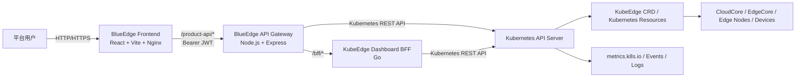
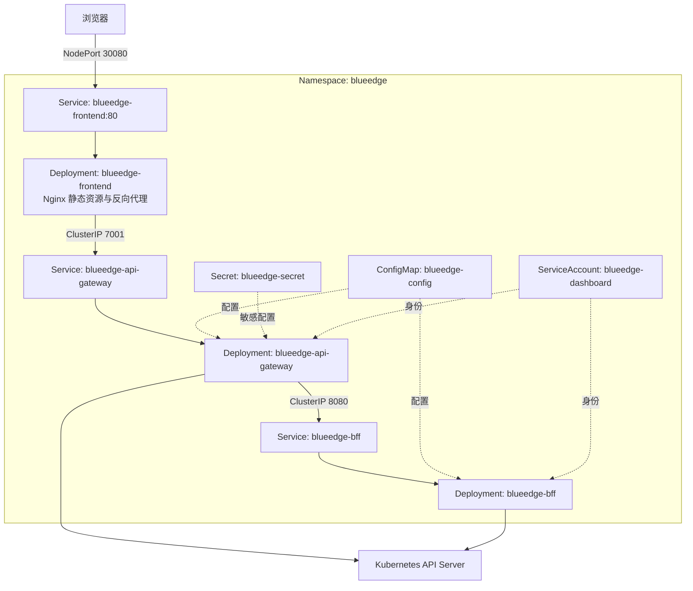
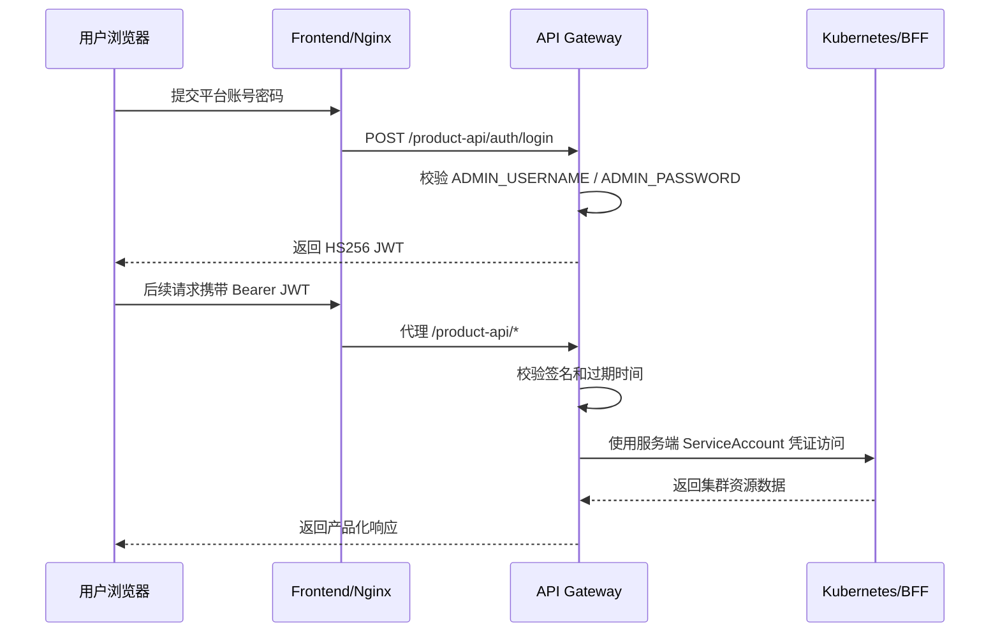

# BlueEdge 平台上线技术文档

> 文档版本：V1.2  
> 编制日期：2026-07-22  
> 适用范围：BlueEdge 当前代码仓库及 Kubernetes YAML 部署方式  
> 文档状态：上线交付版  
> 系统版本：v1.2.1  
> 作者：熊楷  
> 运维负责人：路学春

## 1. 文档目的

本文档用于说明 BlueEdge 平台上线后的总体架构、组件职责、请求链路、部署方式、安全边界、运维操作、监控检查、故障处理和回滚流程，供开发、测试、实施、运维及后续接手人员使用。

本文以当前仓库代码和 `deploy/k8s/blueedge` 部署清单为事实依据。生产域名、证书、SLA、备份策略、告警接收人等无法从代码确认的组织信息统一标记为“待确认”。

### 1.1 正式环境信息

| 项目 | 正式环境配置 |
| --- | --- |
| 系统版本 | `v1.2.1` |
| 正式上线日期 | 2026-07-22 |
| 访问地址 | [http://14.103.139.131:30080/](http://14.103.139.131:30080/) |
| 登录账号 | `admin` |
| 登录密码 | `2026@bluedot` |
| 作者 | 熊楷 |
| 运维负责人 | 路学春 |

> 安全提示：本文记录了正式环境登录凭据，应按内部受控文档管理，禁止发布到公共代码仓库或对外分发。建议交付完成后通过密码管理系统传递凭据，并从文档中移除明文密码。

正式入口已于 2026-07-22 通过 HTTP 检查：前端 `/` 返回 `200 OK`，`/product-api/healthz` 返回 `200 OK`。当前响应由 `nginx/1.27.5` 提供，未发现生产域名和 HTTPS 入口，现阶段按 HTTP NodePort 方式对外服务。

## 2. 系统概述

BlueEdge 是面向 Kubernetes / KubeEdge 场景的边缘计算管理平台。系统保留 KubeEdge Dashboard 官方 BFF 作为基础资源接口，同时通过自研前端和产品 API Gateway 提供统一登录、接口适配、资源汇总、监控指标、事件日志、批量任务、边缘单元、存储和设备管理等产品能力。

核心设计原则如下：

1. 前端完全自研，页面不直接消费官方 BFF 的原始响应。
2. `frontend/src/api/adapters` 负责把后端数据转换成页面领域模型。
3. `server/api-gateway` 负责平台登录、鉴权、业务聚合和产品增强能力。
4. 官方 KubeEdge Dashboard BFF 保持独立，避免产品逻辑侵入上游代码。
5. Kubernetes 凭证只保存在服务端，浏览器仅持有 BlueEdge 平台 JWT。

## 3. 总体架构

### 3.1 逻辑架构



### 3.2 部署拓扑



当前 YAML 的三个 Deployment 均为单副本，并通过 `nodeSelector: kubernetes.io/hostname: k8s-master` 固定在云侧主节点。前端使用 NodePort `30080` 对外暴露，网关和 BFF 使用 ClusterIP，仅在集群内访问。

### 3.3 正式集群现状

2026-07-22 采集到的正式集群信息如下：

| 项目 | 当前值 |
| --- | --- |
| 控制面主机名 | `k8s-master` |
| Kubernetes API Server | `https://192.168.0.2:6443` |
| Kubernetes Client / Server | `v1.32.13` / `v1.32.13` |
| Kustomize | `v5.5.0` |
| 节点总数 | 8 |
| 控制面节点 | 1 个，`k8s-master`，Ready |
| 边缘节点 | 7 个，其中 3 个 Ready、4 个 NotReady |
| 集群总体状态 | 4 个 Ready、4 个 NotReady |
| 控制面容器运行时 | `containerd://2.1.3` |

边缘节点上报的版本并不完全一致：`aipc-31` 为 `v1.30.7-kubeedge-v1.21.0`，其余本次可见的新节点主要为 `v1.32.10-kubeedge-v1.23.0`。因此当前是混合 KubeEdge / Kubernetes 节点版本环境，CloudCore 的精确镜像版本仍需单独查询后才能确定平台服务端 KubeEdge 版本。

当前节点状态：

| 节点 | 角色 | 状态 | 内网地址 |
| --- | --- | --- | --- |
| `k8s-master` | control-plane | Ready | `192.168.0.2` |
| `nano-desktop` | agent, edge | Ready | `192.168.3.153` |
| `rk3588-1` | agent, edge | Ready | `192.168.3.141` |
| `visionfive2-1` | agent, edge | Ready | `192.168.3.92` |
| `aipc-31` | agent, edge | NotReady | `192.168.3.31` |
| `coco` | agent, edge | NotReady | `172.24.158.231` |
| `nano2` | agent, edge | NotReady | `192.168.3.185` |
| `stg-04` | agent, edge | NotReady | `192.168.3.123` |

### 3.4 请求链路

典型业务请求链路：

```text
浏览器
  -> blueedge-frontend:80
  -> Nginx /product-api/* 反向代理
  -> blueedge-api-gateway:7001
     -> /bff/* 转发到 blueedge-bff:8080/api/v1
     -> /blueedge/*、/metrics/*、/events 等由网关聚合或直接访问 Kubernetes API
  -> Kubernetes API Server / KubeEdge CRD
```

本地开发链路与生产一致，只是前端代理由 Vite 提供：

```text
localhost:3000 -> localhost:7001 -> localhost:8080/api/v1
                                  -> localhost:16443 -> 远端 Kubernetes API Server
```

## 4. 技术栈

| 层次 | 主要技术 | 职责 |
| --- | --- | --- |
| 前端 | React 19、TypeScript、Vite、React Router、Tailwind CSS、Radix UI、Recharts | 页面展示、交互、路由、领域模型适配 |
| Web 服务 | Nginx | 静态资源托管、SPA 回退、`/product-api` 反向代理 |
| 产品网关 | Node.js、Express、TypeScript | 平台鉴权、业务聚合、代理、Kubernetes API 访问 |
| 官方 BFF | KubeEdge Dashboard `modules/api`、Go | KubeEdge / Kubernetes 基础资源接口 |
| 容器平台 | Docker、Kubernetes、Kustomize | 镜像构建、服务编排、配置与发布 |
| 数据来源 | Kubernetes API、KubeEdge CRD、metrics.k8s.io | 资源状态、设备、边缘节点、指标、事件和日志 |

当前系统不依赖独立业务数据库。平台业务配置主要通过 Kubernetes 资源及 `blueedge-system` 命名空间内的 ConfigMap 等对象持久化；因此 Kubernetes 集群数据备份等同于关键业务数据保护的一部分。

## 5. 组件说明

### 5.1 BlueEdge Frontend

目录：`frontend/`

主要职责：

- 提供登录、首页、集群资源、边缘节点、节点组、边缘单元、批量任务、工作负载、存储、设备模型、设备实例、规则和 RBAC 等页面。
- 通过 HashRouter 管理前端路由，适应 Nginx 静态部署。
- 使用 `frontend/src/api/request.ts` 统一封装 HTTP 请求、JWT 注入、错误解析和 401 跳转。
- 使用 `frontend/src/api/adapters` 隔离页面模型和后端原始模型。
- 默认通过 `/product-api` 访问网关，通过 `/product-api/bff` 使用官方 BFF 接口。

### 5.2 BlueEdge API Gateway

目录：`server/api-gateway/`

主要职责：

- 提供 `/auth/login` 登录接口并签发 HS256 JWT。
- 除 `/healthz` 和 `/auth/login` 外，所有接口统一经过 JWT 校验。
- 代理官方 BFF，并将服务端 Kubernetes 凭证注入上游请求。
- 直接调用 Kubernetes API，补充官方 BFF 未覆盖的资源和操作。
- 提供首页聚合、集群指标、事件、日志、存储、边缘单元、接入配置、设备汇总、批量任务、部署操作和规则观测能力。
- 通过 `routes -> services -> repositories / clients` 分层组织业务代码。

主要目录：

| 目录 | 说明 |
| --- | --- |
| `src/routes` | HTTP 路由注册和请求参数接入 |
| `src/services` | 业务逻辑、资源聚合与操作编排 |
| `src/repositories` | ConfigMap、Job 等 Kubernetes 持久化访问 |
| `src/clients` | Kubernetes API 与官方 BFF 客户端 |
| `src/middleware` | JWT 鉴权、404 与统一错误处理 |
| `src/types` | 领域类型定义 |

### 5.3 KubeEdge Dashboard BFF

目录：`upstream/kubeedge-dashboard/modules/api/`

官方 BFF 提供 Kubernetes / KubeEdge 基础资源接口，由 `blueedge-api-gateway` 通过 `/bff/*` 统一代理。生产环境中浏览器不应绕过网关直接调用 BFF。

### 5.4 Kubernetes 与 KubeEdge

Kubernetes API Server 是平台资源和状态的最终数据源。平台管理的对象包括 Kubernetes 原生资源以及 Device、DeviceModel、Rule、RuleEndpoint、EdgeApplication 等 KubeEdge CRD。KubeEdge CloudCore / EdgeCore 负责云边协同、边缘节点连接和设备能力下沉，不属于 BlueEdge 三个应用镜像的内部组件。

## 6. 功能模块

| 模块 | 主要能力 | 主要数据来源 |
| --- | --- | --- |
| 首页与仪表盘 | 集群概览、资源统计、趋势与状态 | API Gateway 聚合、metrics.k8s.io |
| 集群与节点 | 集群、节点、节点组、接入配置 | Kubernetes Node、KubeEdge 资源、ConfigMap |
| 边缘单元 | 单元配置、资源归属、应用部署 | ConfigMap、NodeGroup、Deployment、EdgeApplication |
| 工作负载 | Deployment、Pod、Service、日志、事件、回滚与操作 | 官方 BFF、Kubernetes API |
| 批量任务 | 节点升级、镜像预热、批量工作负载 | Kubernetes Job、ConfigMap、事件审计 |
| 存储 | StorageClass、PV、PVC 查询与管理 | Kubernetes Storage API |
| 设备管理 | DeviceModel、Device、设备配置与汇总 | KubeEdge CRD、ConfigMap |
| 规则管理 | RuleEndpoint、Rule、下发状态、事件与审计 | KubeEdge CRD、Kubernetes Events |
| 权限资源 | ServiceAccount、Role、RoleBinding、ClusterRole 等 | Kubernetes RBAC API |

## 7. 接口与鉴权设计

### 7.1 接口入口

| 外部路径 | 网关内部路径 | 用途 |
| --- | --- | --- |
| `/product-api/auth/login` | `/auth/login` | 平台登录 |
| `/product-api/healthz` | `/healthz` | 网关健康检查 |
| `/product-api/bff/*` | `/bff/*` | 代理官方 BFF |
| `/product-api/blueedge/*` | `/blueedge/*` | BlueEdge 产品能力 |
| `/product-api/metrics/*` | `/metrics/*` | 指标查询 |
| `/product-api/events` | `/events` | Kubernetes 事件 |
| `/product-api/storage/*` | `/storage/*` | PV/PVC 管理 |

详细字段和接口契约以 `docs/api-contract.md` 及当前路由代码为准；若文档与代码不一致，应以 `server/api-gateway/src/app.ts` 和 `src/routes/*.ts` 为最终依据并同步修订契约文档。

### 7.2 登录流程



JWT 默认保存在浏览器 `localStorage` 的 `blueedge_token`。当前 Kubernetes ConfigMap 配置的有效期为 `30d`。生产环境应根据安全要求缩短有效期，并结合 HTTPS、强密码、密钥轮换和登录限流降低风险。

## 8. 配置管理

### 8.1 ConfigMap

`blueedge-config` 主要配置：

| 配置项 | 正式环境当前值 | 含义 |
| --- | --- | --- |
| `ADMIN_USERNAME` | `admin` | 平台管理员账号 |
| `JWT_EXPIRES_IN` | `30d` | 平台 JWT 有效期 |
| `BFF_BASE_URL` | `http://blueedge-bff:8080/api/v1` | 官方 BFF 集群内地址 |
| `K8S_API_SERVER` | `https://kubernetes.default.svc` | Kubernetes API Server 地址 |
| `K8S_SKIP_TLS_VERIFY` | `true` | 是否跳过 API Server TLS 校验 |

仓库模板还定义了 `KUBEEDGE_TOKEN_SECRET_*` 和 `KUBEEDGE_TOKEN_MIN_VALIDITY_SECONDS` 等接入 Token 配置，但本次正式环境 ConfigMap 输出中未发现这些字段，应结合当前接入节点功能验证是否需要补齐。

### 8.2 Secret

`blueedge-secret` 至少包含：

- `ADMIN_PASSWORD`
- `JWT_SECRET`

真实 Secret 禁止提交到 Git。建议生产环境接入企业密钥管理系统或 External Secrets，并建立定期轮换机制。

### 8.3 镜像拉取凭证

仓库 YAML 默认引用 `imagePullSecrets: acr-pull-secret`；正式环境采集到的 API Gateway Deployment 实际引用 `my-registry-secret`。运维操作应以正式 Deployment 的实际值为准，并继续核对 Frontend 和 BFF 使用的拉取 Secret 是否一致。

## 9. Kubernetes 部署

### 9.1 资源清单

| 文件 | 资源 |
| --- | --- |
| `00-namespace.yaml` | `blueedge` Namespace |
| `01-rbac.yaml` | ServiceAccount、ClusterRoleBinding |
| `02-configmap.yaml` | 非敏感运行配置 |
| `10-bff.yaml` | BFF Deployment / Service |
| `11-api-gateway.yaml` | API Gateway Deployment / Service |
| `12-frontend.yaml` | Frontend Deployment / NodePort Service |
| `kustomization.yaml` | Kustomize 资源入口 |

### 9.2 上线前检查

```bash
git status --short
cd frontend && npm run build
cd ../server/api-gateway && npm run build && npm test
cd ../..
git diff --check
```

还应确认：

- Kubernetes 与 KubeEdge 集群状态正常。
- `metrics-server` 可用，否则指标页可能无数据。
- `blueedge-secret` 及正式环境实际使用的镜像拉取 Secret 已创建；API Gateway 当前使用 `my-registry-secret`。
- 镜像架构与目标节点一致，当前默认构建目标为 `linux/amd64`。
- 清单中的镜像标签是本次发布标签，而不是历史固定标签。
- `k8s-master` 节点标签真实存在且可调度。
- NodePort `30080` 未被占用，安全组 / 防火墙已按需放通。

### 9.3 部署命令

```bash
kubectl apply -k deploy/k8s/blueedge

kubectl get pods -n blueedge -o wide
kubectl get svc -n blueedge
kubectl rollout status deployment/blueedge-bff -n blueedge --timeout=180s
kubectl rollout status deployment/blueedge-api-gateway -n blueedge --timeout=180s
kubectl rollout status deployment/blueedge-frontend -n blueedge --timeout=180s
```

### 9.4 发布验证

```bash
curl -i http://<node-ip>:30080/
curl -i http://<node-ip>:30080/product-api/healthz

kubectl get deployment -n blueedge \
  -o custom-columns='NAME:.metadata.name,READY:.status.readyReplicas,IMAGE:.spec.template.spec.containers[0].image'

kubectl logs -n blueedge deployment/blueedge-api-gateway --tail=200
kubectl logs -n blueedge deployment/blueedge-bff --tail=200
kubectl logs -n blueedge deployment/blueedge-frontend --tail=200
```

业务验收至少覆盖：登录、首页概览、节点/节点组、Deployment/Pod、设备模型/设备实例、规则、PV/PVC、批量任务和退出登录。

## 10. 镜像构建与版本管理

### 10.1 v1.2.1 正式镜像

镜像仓库服务地址为 `http://183.95.195.121:31438`。容器运行时镜像引用不带 `http://` 协议头，当前正式环境版本如下：

| 组件 | 正式镜像 |
| --- | --- |
| Frontend | `183.95.195.121:31438/blueedge/frontend:2026072203` |
| API Gateway | `183.95.195.121:31438/blueedge/api-gateway:2026072202` |
| BFF | `183.95.195.121:31438/blueedge/bff:2026062201` |

2026-07-22 正式集群的 Deployment 查询结果与上述三个镜像标签一致。`blueedge-api-gateway` 当前为 Deployment revision `17`，最新 ReplicaSet 于 `2026-07-22T13:08:04Z`（北京时间 2026-07-22 21:08:04）完成推进。镜像 digest 尚未采集，仍需通过 Pod 的 `.status.containerStatuses[*].imageID` 补充。

对应 Deployment 更新命令：

```bash
kubectl set image deployment/blueedge-frontend \
  blueedge-frontend=183.95.195.121:31438/blueedge/frontend:2026072203 \
  -n blueedge

kubectl set image deployment/blueedge-api-gateway \
  blueedge-api-gateway=183.95.195.121:31438/blueedge/api-gateway:2026072202 \
  -n blueedge

kubectl set image deployment/blueedge-bff \
  blueedge-bff=183.95.195.121:31438/blueedge/bff:2026062201 \
  -n blueedge
```

### 10.2 构建与版本规则

仓库提供 `scripts/build-docker-images.sh` 构建三个镜像：

```bash
BLUEEDGE_IMAGE_TAG=<release-tag> \
BLUEEDGE_PLATFORM=linux/amd64 \
./scripts/build-docker-images.sh
```

建议镜像版本使用不可变标签，例如 `v1.2.0-20260722.1` 或 Git Commit SHA，禁止在生产发布中仅依赖 `latest`。镜像推送后，应记录三项信息：

- 完整镜像地址和标签；
- 镜像 digest；
- 对应 Git Commit SHA。

上线清单中的三个镜像可以独立升级。若某组件代码没有变化，可保留原镜像，但发布记录必须写明未变更组件及其当前版本。

## 11. 运维与监控

### 11.1 日常巡检

```bash
kubectl get nodes
kubectl get pods -n blueedge -o wide
kubectl get events -n blueedge --sort-by=.lastTimestamp
kubectl top nodes
kubectl top pods -n blueedge
kubectl get endpoints -n blueedge
```

建议每日或由监控系统持续检查：

- 三个 Deployment 的可用副本数和重启次数；
- API Gateway `/healthz` 可用性与响应时间；
- HTTP 4xx / 5xx 比例；
- BFF、Kubernetes API 请求失败率和超时数；
- 节点 Ready 状态、CPU、内存和磁盘压力；
- KubeEdge 边缘节点在线状态；
- 镜像拉取、Pod 调度和 OOMKilled 事件；
- TLS 证书、Secret 和接入 Token 的有效期。

### 11.2 日志

当前应用日志主要输出到容器标准输出。生产环境建议接入 Loki、ELK 或同类日志平台，并至少保留：

- 时间、服务名、环境和版本；
- 请求路径、方法、状态码、耗时和请求 ID；
- 上游 BFF / Kubernetes API 错误；
- 关键变更操作的操作者与审计信息。

严禁记录平台密码、JWT、Kubernetes Token、KubeEdge Join Token、Secret 明文以及完整 Authorization Header。

### 11.3 可用性目标

以下内容需上线负责人确认：

| 项目 | 建议值 | 最终值 |
| --- | --- | --- |
| 服务可用性 | ≥ 99.9% | 待确认 |
| 故障恢复时间 RTO | ≤ 30 分钟 | 待确认 |
| 数据恢复点 RPO | ≤ 24 小时 | 待确认 |
| 日志保留 | 30～90 天 | 待确认 |
| 告警响应 | 5～15 分钟 | 待确认 |

## 12. 安全设计与上线风险

### 12.1 已有安全边界

- Kubernetes Token 不下发到浏览器，由 API Gateway / BFF 在服务端持有。
- 网关除登录和健康检查外统一校验平台 JWT。
- 敏感配置通过 Kubernetes Secret 注入。
- BFF 和 API Gateway 使用 ClusterIP，不直接暴露到集群外。
- 网关设置上游请求超时，默认 30 秒。

### 12.2 上线前必须评估的风险

1. **RBAC 权限过大**：当前 `blueedge-dashboard` 绑定 `cluster-admin`。生产应按真实接口收敛为最小权限 ClusterRole，并拆分只读和变更权限。
2. **TLS 校验关闭**：当前 `K8S_SKIP_TLS_VERIFY=true`。生产应挂载集群 CA 并开启证书校验。
3. **外部入口为 HTTP NodePort**：建议使用 Ingress / API Gateway 对外提供 HTTPS、域名、访问日志、限流和 IP 白名单。
4. **单副本单节点**：三个组件均为 1 副本且固定到 `k8s-master`，存在单点故障。建议无状态组件至少 2 副本，并配置反亲和、PodDisruptionBudget 和资源 requests / limits。
5. **平台账号模型简单**：正式环境已确认使用 `ADMIN_USERNAME=admin` 的单管理员账号，JWT 有效期为 `30d`，不具备用户、角色、权限和会话吊销体系。若面向多用户生产使用，应补充统一身份认证或平台级 RBAC。
6. **JWT 存在 localStorage**：需依靠 HTTPS、CSP 和前端依赖治理降低 XSS 风险；建议评估 HttpOnly Cookie 或短 Token + 刷新机制。
7. **登录防护不足**：建议增加登录限流、失败锁定、密码复杂度、审计和告警。
8. **配置默认值风险**：网关代码存在仅用于开发的默认密码和 JWT Secret；生产环境必须设置 `NODE_ENV=production` 并显式注入安全值。

## 13. 高可用与容量规划

当前清单适合单集群基础部署，不等同于完整高可用方案。生产化建议：

已确认 `blueedge-api-gateway` 正式 Deployment 为 1 副本，且 `resources: {}`，未配置 CPU / 内存 requests 和 limits。其余组件应继续从正式 Deployment 采集资源配置，避免仅以仓库 YAML 推断运行状态。

- Frontend 和 API Gateway 副本数提升到 2～3；BFF 是否可多副本需结合上游行为验证。
- 配置 CPU / 内存 requests 和 limits，结合监控数据调整。
- 配置 readinessProbe 和 livenessProbe；网关可使用 `/healthz`，前端可检查 `/`。
- 通过 Ingress / LoadBalancer 替代直接暴露 NodePort。
- 增加 HorizontalPodAutoscaler 前先完成压测并明确无状态性。
- 对云侧节点设置合理容灾域，避免所有副本落在同一物理节点。
- 对 Kubernetes etcd、关键 Secret、CRD 和 `blueedge-system` 配置建立定期备份与恢复演练。

容量指标需基于以下实际规模评估：集群数量、边缘节点数量、Device / DeviceModel 数量、Pod 数量、并发用户数、日志吞吐和指标查询频率。当前仓库没有可直接证明的容量上限，上线前应完成基准压测。

## 14. 故障排查

| 现象 | 优先检查 | 常见原因 | 处理建议 |
| --- | --- | --- | --- |
| 页面无法打开 | Frontend Pod、Service、NodePort | Pod 未就绪、防火墙未放通、端口冲突 | 检查 Pod/Service/Endpoints 和节点端口 |
| 页面刷新后 404 | Nginx 配置 | SPA 回退缺失 | 确认 `try_files ... /index.html` |
| 登录返回 401 | ConfigMap、Secret、网关日志 | 账号密码不一致、Secret 未更新 | 核对注入值并滚动重启网关 |
| 登录后接口均 401 | JWT Secret、过期时间、浏览器 Token | Secret 变更、Token 过期 | 清理 `blueedge_token` 后重新登录 |
| 接口返回 502 | BFF Service、网关日志 | BFF 不可达、BFF 鉴权失败、上游超时 | 检查 BFF Pod、Endpoints 与凭证 |
| 集群接口 403 | ServiceAccount / RBAC | 权限不足 | 按接口所需资源和动词补充最小权限 |
| 指标为空 | metrics-server | metrics API 不可用 | 检查 `apiservice v1beta1.metrics.k8s.io` |
| Pod 为 ImagePullBackOff | 镜像地址、拉取 Secret | 标签不存在、仓库无权限 | 核对镜像及 Deployment 实际引用的 imagePullSecret；API Gateway 当前为 `my-registry-secret` |
| Pod 为 Pending | nodeSelector、资源、污点 | 无匹配节点或资源不足 | 检查节点标签、taint、调度事件 |
| 设备/规则无数据 | CRD、CloudCore、命名空间 | KubeEdge 未安装、CRD 版本不匹配 | 检查 CRD、CloudCore 和 BFF 返回 |

通用排查命令：

```bash
kubectl describe pod -n blueedge <pod-name>
kubectl logs -n blueedge <pod-name> --previous
kubectl get endpoints -n blueedge
kubectl get events -n blueedge --sort-by=.lastTimestamp
kubectl auth can-i --as=system:serviceaccount:blueedge:blueedge-dashboard --list
```

## 15. 发布与回滚

### 15.1 发布原则

- 发布前记录当前三个 Deployment 的完整镜像地址，作为回滚基线。
- 先完成构建、测试和镜像扫描，再推送镜像。
- 仅升级本次有代码变化的组件。
- 按 `BFF -> API Gateway -> Frontend` 或根据兼容性要求分阶段发布。
- 每个组件发布后等待 rollout 完成并执行冒烟检查。

### 15.2 记录发布基线

```bash
kubectl get deployment -n blueedge \
  -o custom-columns='NAME:.metadata.name,IMAGE:.spec.template.spec.containers[0].image'
```

### 15.3 更新镜像

```bash
kubectl set image deployment/blueedge-bff \
  blueedge-bff=<registry>/blueedge/bff:<tag> -n blueedge

kubectl set image deployment/blueedge-api-gateway \
  blueedge-api-gateway=<registry>/blueedge/api-gateway:<tag> -n blueedge

kubectl set image deployment/blueedge-frontend \
  blueedge-frontend=<registry>/blueedge/frontend:<tag> -n blueedge
```

### 15.4 回滚

优先回滚到发布前记录的明确镜像版本：

```bash
kubectl set image deployment/<deployment> \
  <container>=<previous-image> -n blueedge
kubectl rollout status deployment/<deployment> -n blueedge --timeout=180s
```

也可以在确认 Deployment 历史完整时使用：

```bash
kubectl rollout history deployment/<deployment> -n blueedge
kubectl rollout undo deployment/<deployment> -n blueedge
```

回滚后必须重新检查 `/`、`/product-api/healthz`、登录和关键业务查询。若发布包含 CRD、配置格式或不可逆数据变更，必须在发布方案中另行提供兼容和数据恢复步骤。

## 16. 备份与恢复

BlueEdge 本身暂无独立数据库，恢复重点在 Kubernetes 控制面及平台管理资源：

- Kubernetes etcd 定期快照；
- KubeEdge 相关 CRD 与自定义资源导出；
- `blueedge-system` 命名空间内平台 ConfigMap 等配置；
- `blueedge` 命名空间 ConfigMap、Secret 的受控备份；
- 镜像仓库中的发布镜像和 digest；
- Git 仓库、发布清单和版本记录。

Secret 备份必须加密并限制访问。恢复方案需至少每季度演练一次，实际周期待运维负责人确认。

## 17. 上线验收清单

### 17.1 基础环境

- [ ] Kubernetes / KubeEdge 版本和兼容性已确认。
- [ ] 云侧节点标签、污点和容量满足调度要求。
- [ ] 镜像仓库、拉取 Secret 和镜像 digest 已确认。
- [ ] 生产域名、HTTPS 证书、防火墙和访问策略已配置。
- [ ] 时间同步、DNS 和 metrics-server 正常。

### 17.2 配置与安全

- [ ] 生产管理员密码和 JWT Secret 已安全生成并注入。
- [ ] 未使用代码中的开发默认密码或密钥。
- [ ] RBAC 已按生产要求收敛，不再直接使用 cluster-admin，或风险已书面批准。
- [ ] Kubernetes API TLS 校验已开启，或风险已书面批准。
- [ ] 日志不会输出 Token、密码和 Secret。
- [ ] 登录限流、密码策略和访问审计已落实或明确整改计划。

### 17.3 功能与运维

- [ ] 前端构建、网关构建和自动化测试通过。
- [ ] 三个 Deployment rollout 成功且无异常重启。
- [ ] 健康检查、登录及核心业务冒烟通过。
- [ ] 监控、日志和告警已接入。
- [ ] 发布基线、回滚镜像和回滚负责人已记录。
- [ ] 备份任务和恢复演练计划已确认。
- [ ] 运维、研发、测试和业务验收人完成签字。

## 18. 待确认事项

1. v1.2.1 正式发布对应的 Git Commit SHA。
2. 是否计划为当前 HTTP NodePort 入口增加生产域名和 HTTPS 证书。
3. CloudCore 正式镜像及精确 KubeEdge 服务端版本；当前边缘节点存在 KubeEdge v1.21.0 与 v1.23.0 混合版本。
4. 三个正式镜像对应的 digest。
5. 单管理员账号是否为长期方案，还是后续接入统一身份认证。
6. 生产 RBAC 最小权限方案及审批结果。
7. Frontend、BFF 的正式副本数与资源配置，以及全平台容量基线；API Gateway 已确认为 1 副本且未设置 requests / limits。
8. SLA、RTO、RPO、日志保留期和告警联系人。
9. etcd、CRD、Secret 和 BlueEdge 配置的备份平台与周期。
10. 安全扫描、渗透测试和等保相关要求。

## 19. 代码与文档索引

| 内容 | 路径 |
| --- | --- |
| 项目说明 | `README.md` |
| 前端入口与路由 | `frontend/src/App.tsx` |
| 前端请求封装 | `frontend/src/api/request.ts` |
| 前端适配层 | `frontend/src/api/adapters/` |
| Nginx 配置 | `deploy/frontend.nginx.conf` |
| 网关应用装配 | `server/api-gateway/src/app.ts` |
| 网关运行配置 | `server/api-gateway/src/config.ts` |
| 网关路由 | `server/api-gateway/src/routes/` |
| 网关业务服务 | `server/api-gateway/src/services/` |
| Kubernetes 客户端 | `server/api-gateway/src/clients/k8s-client.ts` |
| BFF 客户端 | `server/api-gateway/src/clients/bff-client.ts` |
| 接口契约 | `docs/api-contract.md` |
| K8s 部署说明 | `deploy/k8s/blueedge/README.md` |
| K8s 部署清单 | `deploy/k8s/blueedge/` |
| Docker Compose | `deploy/docker-compose.yml` |
| 镜像构建脚本 | `scripts/build-docker-images.sh` |
| 本地开发栈 | `scripts/run-dev-stack.sh` |

## 20. 变更记录

| 版本 | 日期 | 说明 | 作者 |
| --- | --- | --- | --- |
| V1.0 | 2026-07-22 | 基于当前仓库生成上线技术文档初稿 | 熊楷 |
| V1.1 | 2026-07-22 | 补充 v1.2.1 正式环境、登录信息、镜像版本及运维负责人 | 熊楷 |
| V1.2 | 2026-07-22 | 补充上线时间、正式集群版本与节点状态、运行镜像及 API Gateway 配置现状 | 熊楷 |
